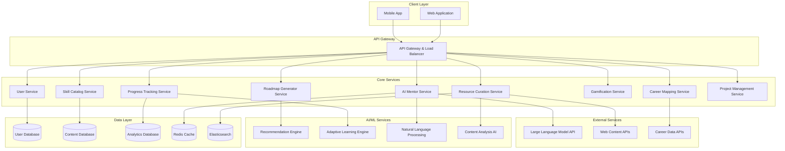

# Design Document: SkillPilot AI Platform

## Overview

SkillPilot AI is designed as a cloud-native, microservices-based learning platform that leverages AI to provide personalized learning experiences. The system follows a modular architecture where AI capabilities are embedded as independent services, each responsible for specific functionality like content curation, learning path generation, progress tracking, and real-time mentoring.

The platform employs a hybrid recommendation system combining collaborative filtering, content-based filtering, and reinforcement learning to adapt learning paths dynamically. Real-time communication is achieved through WebSocket connections for the AI mentor system, while the core platform uses RESTful APIs for standard operations.

Key architectural principles include:
- **Microservices Architecture**: Each major component operates as an independent service
- **AI-First Design**: AI capabilities are integrated at the core, not as an afterthought  
- **Event-Driven Communication**: Services communicate through events for loose coupling
- **Scalable Data Pipeline**: Handles large volumes of learning data and user interactions
- **Real-Time Capabilities**: WebSocket-based communication for instant AI mentoring

## Architecture

### High-Level Architecture



### Service Communication Patterns

**Synchronous Communication (REST APIs)**:
- Client-to-service communication through API Gateway
- Service-to-service calls for immediate data needs
- Real-time queries requiring immediate responses

**Asynchronous Communication (Event-Driven)**:
- Progress updates triggering adaptive learning adjustments
- User activity events for analytics and recommendations
- Content curation events for resource updates

**WebSocket Communication**:
- Real-time AI mentor chat sessions
- Live progress updates during learning sessions
- Instant notifications and alerts

## Components and Interfaces

### User Service
**Responsibilities**: User authentication, profile management, preferences
**Key Interfaces**:
- `POST /api/users/register` - User registration
- `GET /api/users/{id}/profile` - Retrieve user profile
- `PUT /api/users/{id}/preferences` - Update learning preferences
- `POST /api/users/authenticate` - User authentication

**Data Models**:
```typescript
interface User {
  id: string;
  email: string;
  profile: UserProfile;
  preferences: LearningPreferences;
  createdAt: Date;
  lastActive: Date;
}

interface UserProfile {
  name: string;
  skillLevels: Map<string, SkillLevel>;
  availableTime: TimePreference;
  learningGoals: string[];
}
```

### Skill Catalog Service
**Responsibilities**: Maintain skill taxonomy, skill relationships, prerequisites
**Key Interfaces**:
- `GET /api/skills` - List available skills
- `GET /api/skills/{id}` - Get skill details
- `GET /api/skills/{id}/prerequisites` - Get skill prerequisites
- `POST /api/skills/{id}/assess` - Skill assessment

### Roadmap Generator Service
**Responsibilities**: AI-powered learning path generation, roadmap customization
**Key Interfaces**:
- `POST /api/roadmaps/generate` - Generate personalized roadmap
- `GET /api/roadmaps/{id}` - Retrieve roadmap
- `PUT /api/roadmaps/{id}/adjust` - Adjust roadmap based on progress

**Integration**: Communicates with Recommendation Engine and Adaptive Learning Engine

### Resource Curation Service
**Responsibilities**: Web content discovery, quality assessment, resource management
**Key Interfaces**:
- `GET /api/resources/search` - Search curated resources
- `POST /api/resources/curate` - Trigger curation for topic
- `GET /api/resources/{id}/alternatives` - Get alternative resources

**AI Integration**: Uses Content Analysis AI for quality scoring and relevance assessment

### Progress Tracking Service
**Responsibilities**: Learning activity tracking, progress analytics, performance metrics
**Key Interfaces**:
- `POST /api/progress/activity` - Record learning activity
- `GET /api/progress/{userId}/dashboard` - Get progress dashboard
- `GET /api/progress/{userId}/analytics` - Get detailed analytics

**Event Publishing**: Publishes progress events for adaptive learning adjustments

### AI Mentor Service
**Responsibilities**: Real-time conversational AI, contextual help, learning guidance
**Key Interfaces**:
- `WebSocket /ws/mentor/{sessionId}` - Real-time chat connection
- `POST /api/mentor/context` - Set learning context
- `GET /api/mentor/history/{userId}` - Get conversation history

**AI Integration**: Integrates with Large Language Model APIs and maintains conversation context

### Gamification Service
**Responsibilities**: XP tracking, achievement system, leaderboards, streaks
**Key Interfaces**:
- `POST /api/gamification/award-xp` - Award experience points
- `GET /api/gamification/{userId}/achievements` - Get user achievements
- `GET /api/gamification/leaderboard` - Get leaderboard data

### Adaptive Learning Engine
**Responsibilities**: Learning path optimization, difficulty adjustment, personalization
**Key Interfaces**:
- `POST /api/adaptive/analyze-performance` - Analyze user performance
- `GET /api/adaptive/{userId}/recommendations` - Get adaptive recommendations
- `PUT /api/adaptive/{userId}/adjust-path` - Adjust learning path

**ML Models**: 
- Reinforcement learning for long-term optimization
- Collaborative filtering for peer-based recommendations
- Performance prediction models

## Data Models

### Core Learning Entities

```typescript
interface Skill {
  id: string;
  name: string;
  category: string;
  description: string;
  prerequisites: string[];
  estimatedHours: number;
  difficulty: SkillLevel;
  tags: string[];
}

interface LearningRoadmap {
  id: string;
  userId: string;
  skillId: string;
  steps: LearningStep[];
  estimatedCompletion: Date;
  adaptiveAdjustments: AdaptiveAdjustment[];
  createdAt: Date;
  lastModified: Date;
}

interface LearningStep {
  id: string;
  title: string;
  description: string;
  resources: Resource[];
  estimatedDuration: number;
  prerequisites: string[];
  completionCriteria: CompletionCriteria;
  order: number;
}

interface Resource {
  id: string;
  title: string;
  url: string;
  type: ResourceType; // VIDEO, ARTICLE, TUTORIAL, EXERCISE
  duration: number;
  difficulty: SkillLevel;
  qualityScore: number;
  tags: string[];
  metadata: ResourceMetadata;
}

interface LearningSession {
  id: string;
  userId: string;
  roadmapId: string;
  stepId: string;
  startTime: Date;
  endTime?: Date;
  activitiesCompleted: string[];
  timeSpent: number;
  performanceMetrics: PerformanceMetrics;
}

interface ProgressRecord {
  userId: string;
  skillId: string;
  roadmapId: string;
  completionPercentage: number;
  timeSpent: number;
  milestonesAchieved: string[];
  currentStep: string;
  performanceHistory: PerformanceSnapshot[];
  lastUpdated: Date;
}
```

### AI and Analytics Models

```typescript
interface RecommendationContext {
  userId: string;
  currentSkill: string;
  learningHistory: LearningActivity[];
  preferences: LearningPreferences;
  performanceMetrics: PerformanceMetrics;
  timeConstraints: TimeConstraints;
}

interface AdaptiveAdjustment {
  type: AdjustmentType; // ACCELERATE, REINFORCE, SKIP, ADD_PRACTICE
  reason: string;
  targetSteps: string[];
  confidence: number;
  appliedAt: Date;
}

interface MentorContext {
  userId: string;
  currentTopic: string;
  learningObjective: string;
  recentActivities: LearningActivity[];
  strugglingAreas: string[];
  conversationHistory: ChatMessage[];
}

interface PerformanceMetrics {
  comprehensionRate: number;
  completionSpeed: number;
  retentionScore: number;
  engagementLevel: number;
  difficultyPreference: SkillLevel;
}
```

### Gamification Models

```typescript
interface UserGamificationProfile {
  userId: string;
  totalXP: number;
  level: number;
  currentStreak: number;
  longestStreak: number;
  achievements: Achievement[];
  badges: Badge[];
  leaderboardRank?: number;
}

interface Achievement {
  id: string;
  name: string;
  description: string;
  criteria: AchievementCriteria;
  xpReward: number;
  unlockedAt: Date;
  rarity: AchievementRarity;
}
```

## Correctness Properties

*A property is a characteristic or behavior that should hold true across all valid executions of a system—essentially, a formal statement about what the system should do. Properties serve as the bridge between human-readable specifications and machine-verifiable correctness guarantees.*

Before defining the correctness properties, I need to analyze the acceptance criteria from the requirements to determine which ones are testable as properties.
